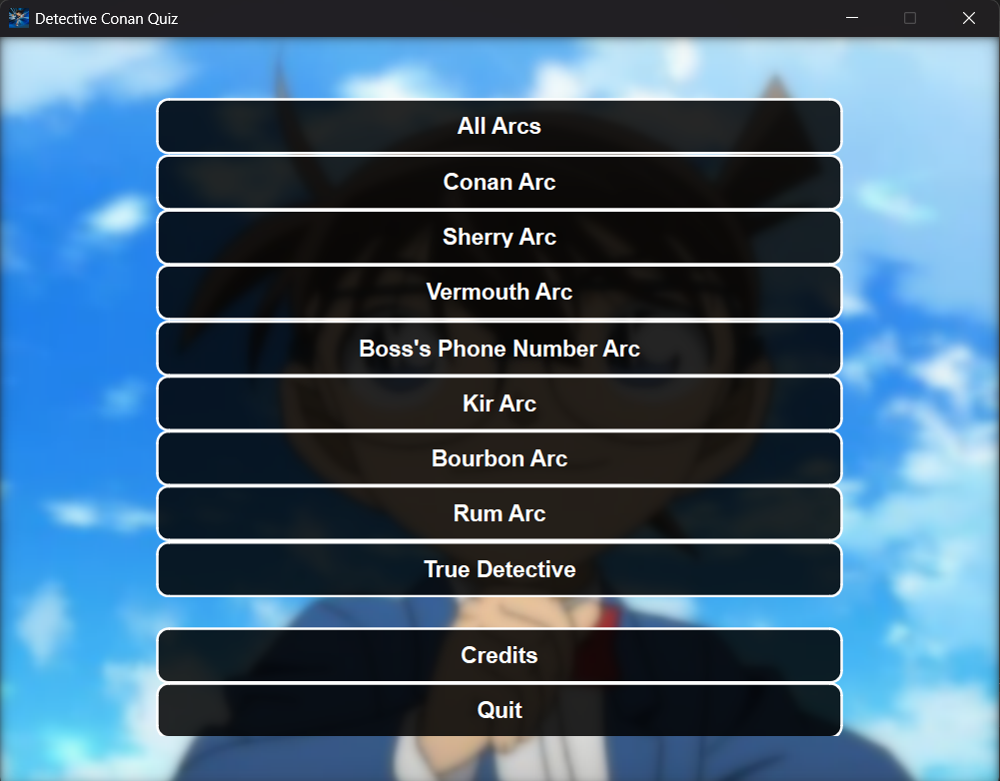

# Detective Conan Quiz

## Introduction

Detective Conan Quiz is a fun and interactive quiz game based on the popular anime and manga series "Detective Conan" (also known as "Case Closed"). This application tests your knowledge about different story arcs, characters, and events from the series.

The quiz features questions from various story arcs including Conan Arc, Sherry Arc, Vermouth Arc, Boss's Phone Number Arc, Kir Arc, Bourbon Arc, and Rum Arc. You can also challenge yourself with the "True Detective" mode that combines questions from all arcs!

## Main Menu

## Technical Features

- **PyQt6 GUI**: Modern and responsive user interface
- **Dynamic Question Loading**: Questions loaded from JSON file for easy updates
- **Animated Backgrounds**: Subtle zoom and pan animations for background images
- **Score Tracking**: Keeps track of your performance with percentage calculation
- **Progress Bar**: Visual indicator of quiz progress
- **Randomized Questions**: Questions are shuffled for a fresh experience each time
- **Visual Feedback**: Color-coded buttons show correct/incorrect answers
- **Multiple Quiz Modes**: Choose from individual arcs or combined challenges

## Project Structure

- **GUI Version**: Complete graphical user interface with PyQt6
- **No GUI Version**: Command-line version of the quiz for text-based interfaces

## How to Run

1. Make sure you have Python installed (Python 3.6 or higher recommended)
2. Install required dependencies: `pip install PyQt6`
3. Run the application: `python gui/main.py`

## Copyright

© Med Yessine Khmiri (Student)

## License

This project is licensed under the MIT License - see the [LICENSE](./LICENSE) file for details.
