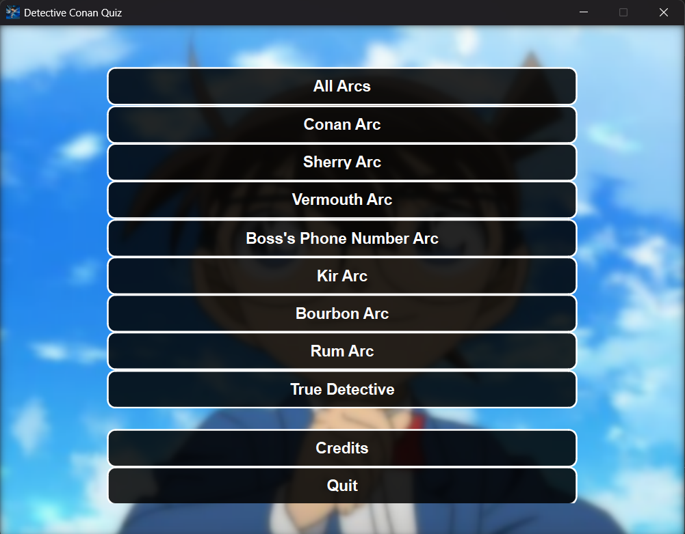
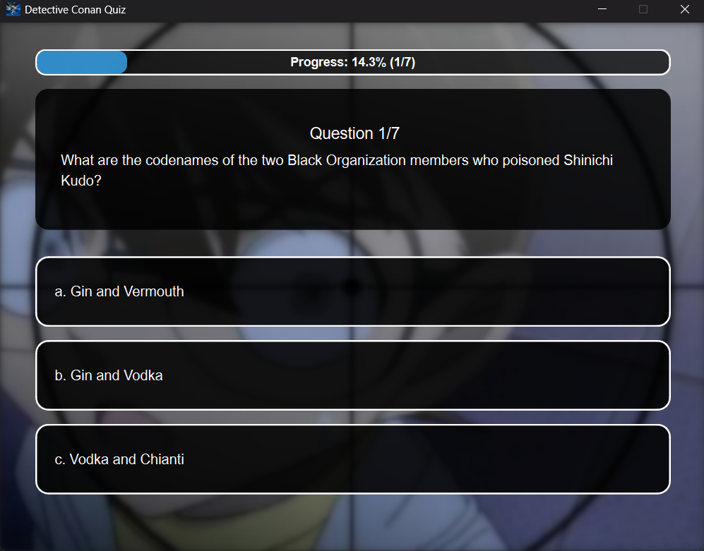
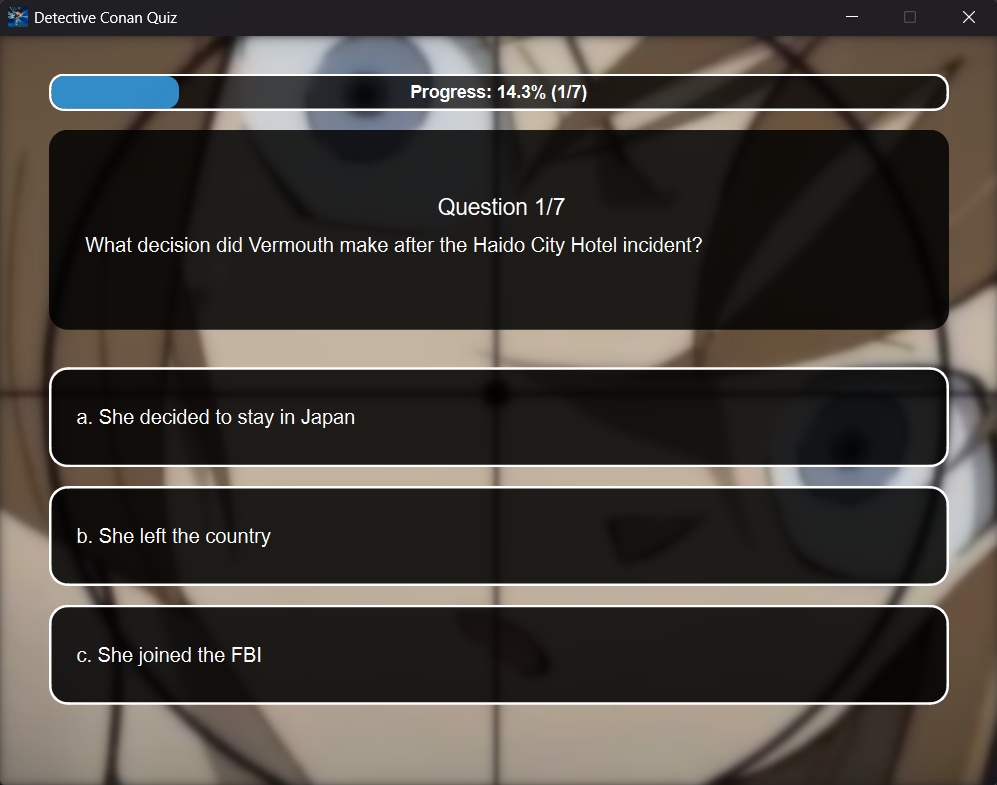
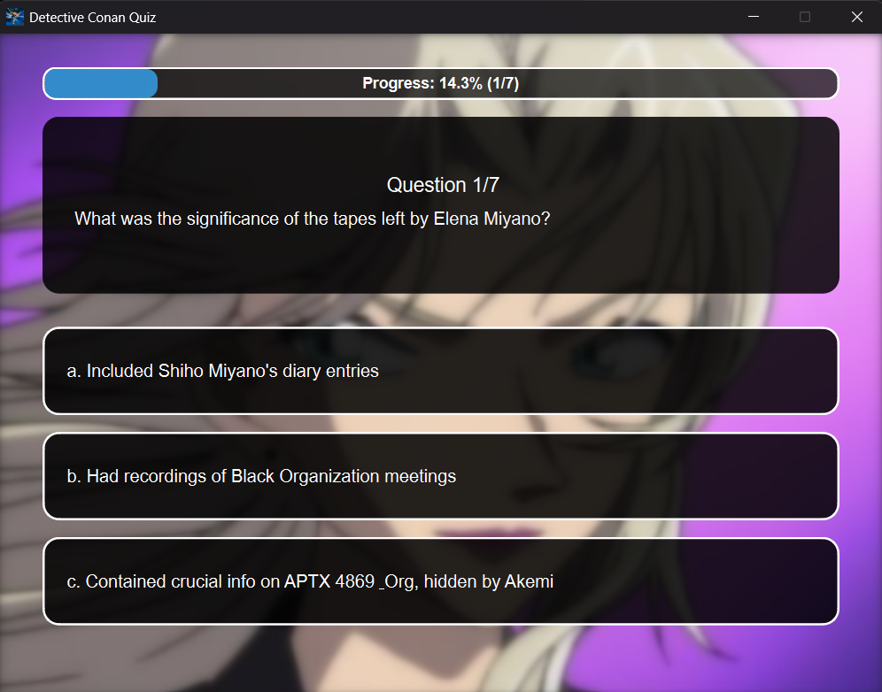
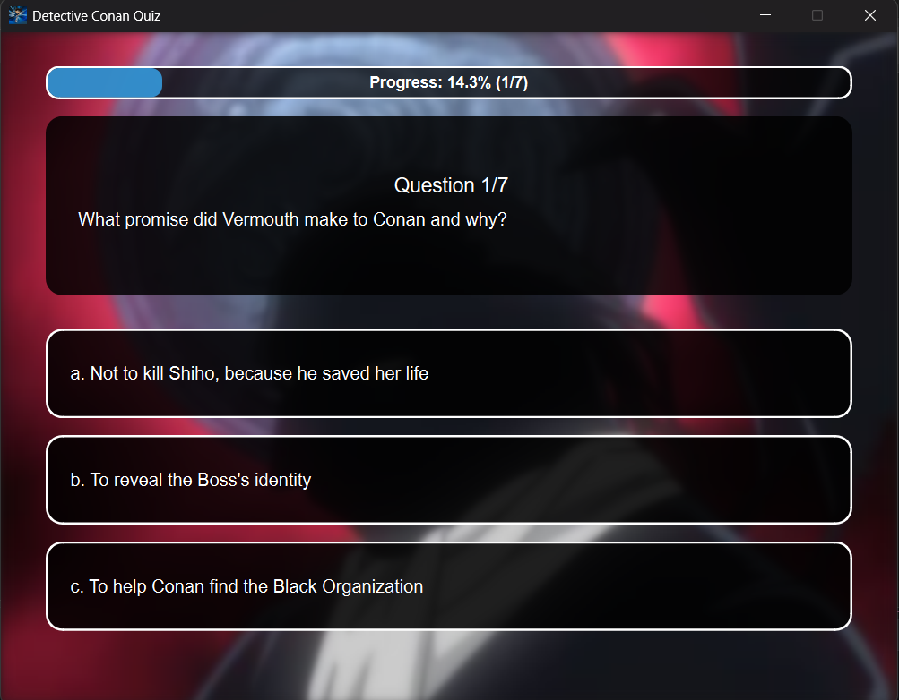
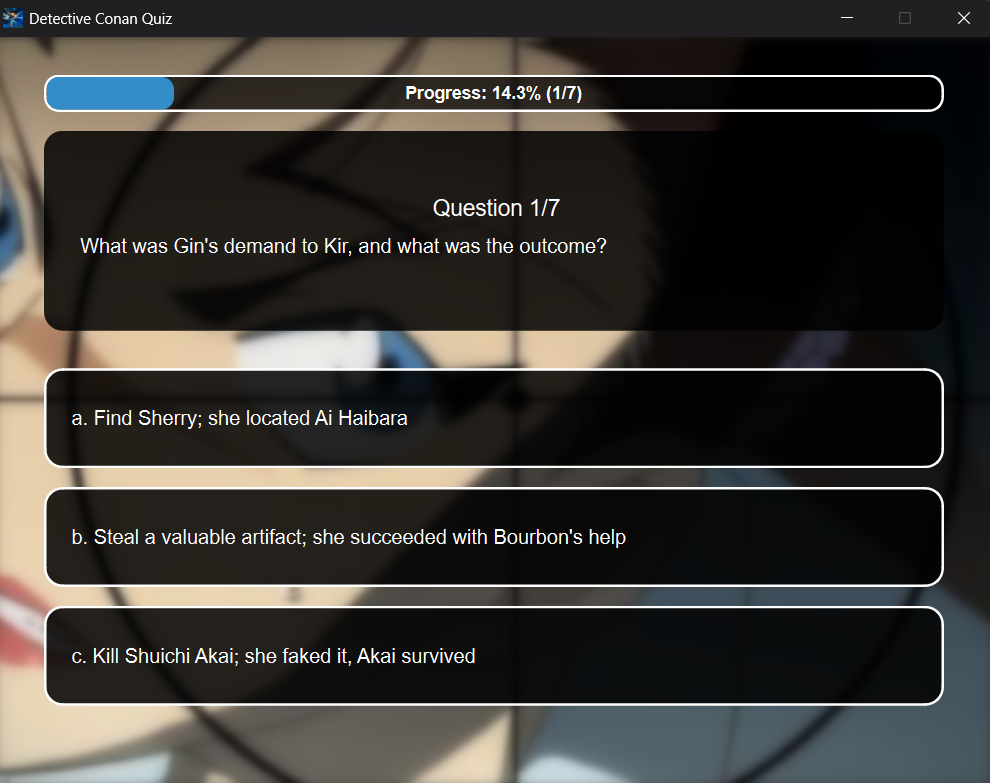
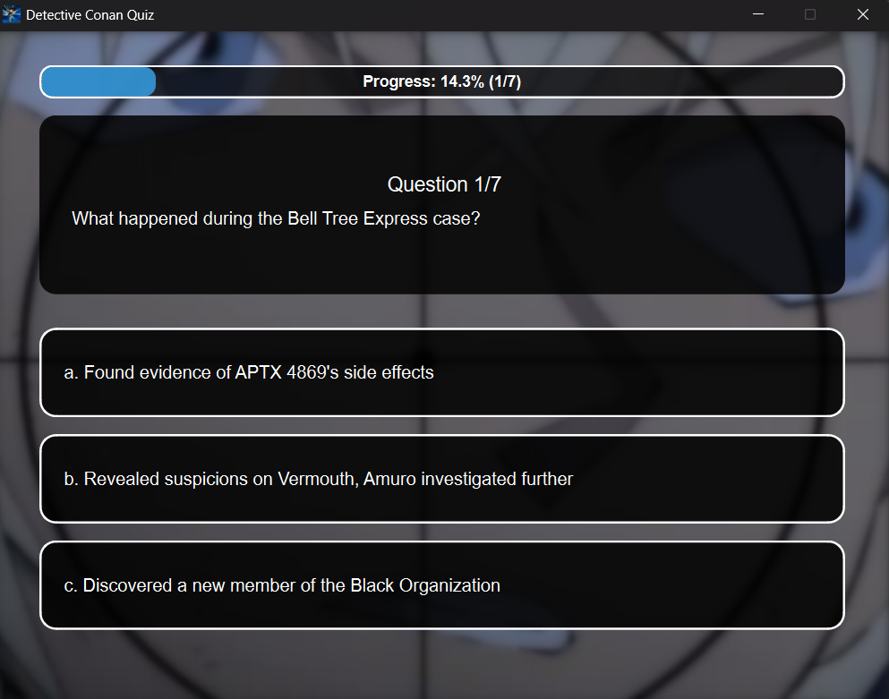
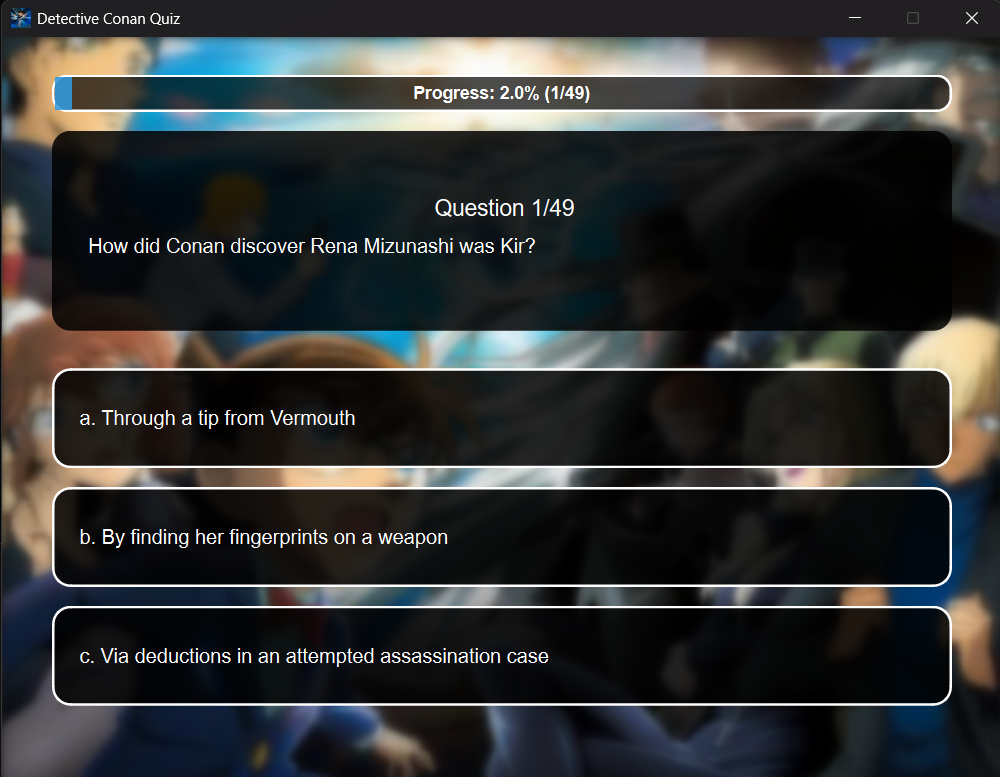
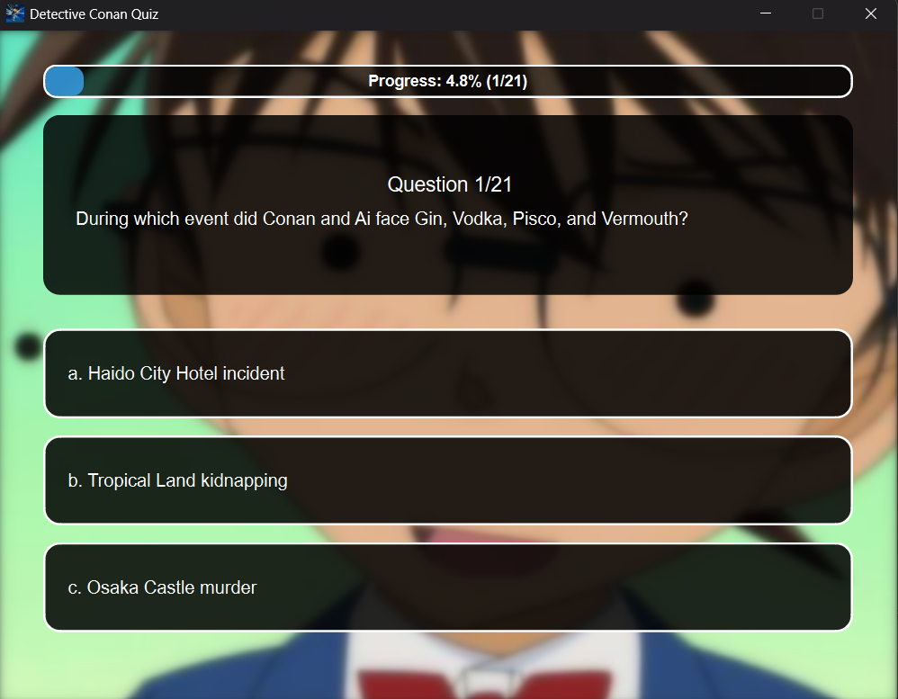

# Detective Conan Quiz

## Introduction

Detective Conan Quiz is a fun and interactive quiz game based on the popular anime and manga series "Detective Conan" (also known as "Case Closed"). This application tests your knowledge about different story arcs, characters, and events from the series.

The quiz features questions from various story arcs including Conan Arc, Sherry Arc, Vermouth Arc, Boss's Phone Number Arc, Kir Arc, Bourbon Arc, and Rum Arc. You can also challenge yourself with the "True Detective" mode that combines questions from all arcs!

## Features

### Main Menu


### Story Arcs
Test your knowledge across different Detective Conan story arcs:

#### Core Arcs
  

#### Organization Arcs
   

#### Special Modes
 

### Dynamic Interface
- **Animated Backgrounds**: Each quiz section features subtle zoom and pan animations that bring the backgrounds to life, creating an immersive experience
- **Smooth Transitions**: Elegant transitions between screens and questions
- **Visual Feedback**: Color-coded buttons show correct/incorrect answers instantly

## Technical Features

- **PyQt6 GUI**: Modern and responsive user interface
- **Dynamic Question Loading**: Questions loaded from JSON file for easy updates
- **Score Tracking**: Keeps track of your performance with percentage calculation
- **Progress Bar**: Visual indicator of quiz progress
- **Randomized Questions**: Questions are shuffled for a fresh experience each time
- **Multiple Quiz Modes**: Choose from individual arcs or combined challenges

## Project Structure

- **GUI Version**: Complete graphical user interface with PyQt6
- **No GUI Version**: Command-line version of the quiz for text-based interfaces

## How to Run

1. Make sure you have Python installed (Python 3.6 or higher recommended)  
2. Install required dependencies:  
   ```bash
   pip install PyQt6
